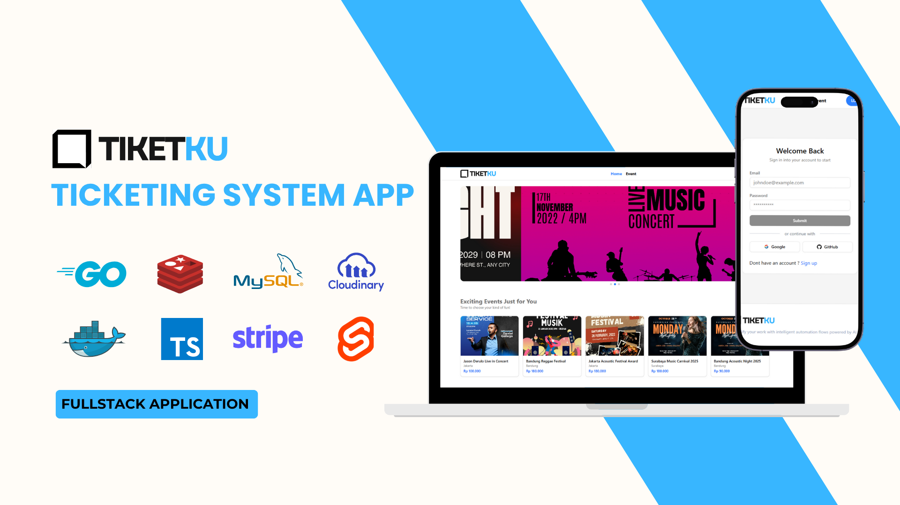

# 🎟️ Tiketku – Ticketing System Application

Tiketku is a fullstack event ticketing application designed to simplify the process of event creation, ticket sales, and transaction management. With support for partial refunds, user withdrawal requests, and QR-based ticket validation, Tiketku delivers a complete solution for event organizers and attendees through a modern and flexible platform.

---

## 1. Project Overview

Tiketku was developed to address the complexities of managing small to mid-scale events. Many organizers face challenges with manual ticketing, refund handling, and validating tickets on event day. Evently provides an all-in-one system focused on transaction efficiency, secure payments, and transparent reporting.

This application serves two main roles: as a ticket sales portal for users and as a backend management system for event administrators.

---

## 2. Project Requirements

- User registration and login via OTP and Google OAuth
- Admin-side CRUD for events and tickets
- Ticket purchase by users through Stripe Checkout
- QR-based ticket validation and usage tracking
- Partial refund capability based on event policy
- Withdrawal of user balance after refund
- Exportable transaction reports for admins (CSV)

---

## 3. The Challenge

The main challenge in Evently was designing a flexible yet secure refund system and ensuring a fully traceable ticket lifecycle (purchase, usage, refund). Additionally, managing and exporting transactional data had to be efficient and insightful for administrators.

---

## 4. The Approach & Solution

This system was developed with a modular and scalable approach:

- Backend built using **Golang (Gin)**, with **GORM** for MySQL ORM and **Stripe** integration for payments.
- Frontend built with **SvelteKit** and **TailwindCSS**, powered by **TanStack Query** for data fetching and **Zod** for form validation.
- QR-based ticket validation includes usage tracking and printable tickets.
- Admins can analyze and export transaction reports from the dashboard.

---

## 5. Key Features

- JWT Based Authentication with Access and Refresh Token
- Ticket purchasing via Stripe Checkout
- Partial Refunds based on refund policy percentage
- User Wallet and Withdrawal Request Flow
- Ticket Printing & QR Validation (by admin)
- Transaction Reporting & CSV Export
- API Key Validation for Secured External Access
- Role-Based API Access (User, Admin)

---

## 6. Tech Stack

### 6.1 Frontend

- **SvelteKit**
- **TailwindCSS** + **Lucide Icons**
- **Zod** (form validation)
- **@tanstack/svelte-query** (data fetching)
- **Sonner** (toast notification)
- **Vite** (build tool)

### 6.2 Backend

- **Golang** (Gin Framework)
- **GORM** (MySQL ORM)
- **Redis** (OTP & token store)
- **Stripe** (payment gateway)
- **JWT** (authentication)
- **Docker + Docker Compose**

---

## 7. Project Structure

### 7.1 Frontend

```
src/
├── lib/
│   ├── api/               # API calls
│   ├── schemas/           # Zod schemas
│   ├── services/          # TanStack hooks
│   ├── stores/            # Svelte stores
│   ├── components/        # UI & layout
│   ├── types.ts
│   └── utils.ts
├── routes/
│   ├── +layout.svelte
│   ├── +page.svelte
│   ├── (admin)/
│   │   └── dashboard/
│   ├── (public)/
│   │   ├── (user)/
│   │   ├── events/
│   │   ├── about/
│   │   ├── +layout.svelte
│   │   └── +page.svelte
│   └── (auth)/
│       ├── signup/
│       └── signin/
└── app.d.ts               # Type config
```

### 7.2 Backend

```
server/
├── config/            # Initialization and configuration of dependencies (DB, Redis, Stripe, etc.)
├── cron/              # Cron jobs for scheduled tasks (e.g. auto-expire payments, reminders)
├── dto/               # Data Transfer Objects (request/response schema validation)
├── handlers/          # HTTP handlers (controller layer) for routing logic
├── middleware/        # Middleware functions (auth guard, role checking, API key validation)
├── models/            # GORM models representing the database schema
├── services/          # Core business logic (use-case orchestration layer)
├── repositories/      # Data access layer (DB queries and transactions)
├── routes/            # Route grouping and initialization per feature
├── seeders/           # Seeder scripts for initial dummy or system data
├── utils/             # Helper functions and utilities (e.g., file uploads, formatting)
├── tests/             # Unit and integration tests for handlers, services, and repositories
├── main.go            # Application entry point – initializes router and starts the server
├── docker-compose.yml # Docker orchestration for development and local services
├── Dockerfile
└── .env

```

---

## 8. API Endpoints (Highlights)

All end point start with /api/v1 following with any of the table listed

### 🔐 Authentication

| Method | Endpoint            | Description              |
| ------ | ------------------- | ------------------------ |
| POST   | /auth/login         | Login via email/password |
| POST   | /auth/send-otp      | Send OTP to email        |
| POST   | /auth/verify-otp    | Verify OTP               |
| POST   | /auth/refresh-token | Refresh JWT token        |

### 🧑 User

| Method | Endpoint   | Description       |
| ------ | ---------- | ----------------- |
| GET    | /user/me   | Get current user  |
| PUT    | /user/me   | Update profile    |
| GET    | /user/\:id | Admin: Get by ID  |
| GET    | /user/     | Admin: List users |

### 🎫 Event & Ticket

| Method | Endpoint             | Description           |
| ------ | -------------------- | --------------------- |
| GET    | /events              | List public events    |
| GET    | /events/\:id         | Get event detail      |
| GET    | /events/\:id/tickets | Get tickets for event |
| POST   | /events              | Admin: create event   |
| POST   | /tickets             | Admin: create ticket  |

### 🛒 Order & Payment

| Method | Endpoint                  | Description                |
| ------ | ------------------------- | -------------------------- |
| POST   | /orders                   | Create new order           |
| GET    | /orders                   | Get user orders            |
| GET    | /orders/\:id/user-tickets | Get user ticket from order |
| POST   | /orders/\:id/refund       | Refund order (partial)     |
| POST   | /payments/stripe/webhooks | Stripe webhook             |

### 📋 Report

| Method | Endpoint                    | Description               |
| ------ | --------------------------- | ------------------------- |
| GET    | /reports/transaction        | Admin: all transactions   |
| GET    | /reports/transaction/\:id   | Admin: detail transaction |
| GET    | /reports/transaction/export | Export CSV (with filter)  |

### 📇 Withdrawal

| Method | Endpoint          | Description             |
| ------ | ----------------- | ----------------------- |
| POST   | /withdrawals      | User: create withdrawal |
| GET    | /withdrawals      | Admin: list all         |
| PATCH  | /withdrawals/\:id | Admin: approve/reject   |

### 🎟️ User Ticket

| Method | Endpoint                | Description           |
| ------ | ----------------------- | --------------------- |
| GET    | /user-ticket/\:id       | Get user ticket by ID |
| PATCH  | /user-ticket/\:id/use   | Admin: mark as used   |
| POST   | /user-ticket/validate   | Admin: validate QR    |
| GET    | /user-ticket/\:id/print | Print ticket (PDF)    |

---

## 9. Environment Configuration

### Frontend (`.env`)

```env
VITE_API_SERVICE_URL=https://api.yourdomain.com/api/v1
VITE_API_KEY=your-api-key
VITE_STRIPE_PUBLISHABLE_KEY=pk_test_xxx
```

### Backend (`.env`)

```env
# ==== MySQL ====
DB_HOST=db
DB_PORT=3306
DB_USERNAME=your_mysql_username
DB_NAME=your_db_name
DB_PASSWORD=your_db_password

# ==== Cloudinary ====
CLOUDINARY_CLOUD_NAME=your_cloud_name
CLOUDINARY_API_KEY=your_api_key
CLOUDINARY_API_SECRET=your_api_secret
CLOUDINARY_FOLDER_NAME=your_folder_name

# ==== Nodemailer ====
USER_EMAIL=your_email_address
USER_PASSWORD=your_email_app_password

# ==== Redis ====
REDIS_ADDR=redis:6379
REDIS_PASSWORD=

# ==== App Config ====
PORT=8000
API_KEY=your_api_key_here
JWT_ACCESS_SECRET=your_access_secret
JWT_REFRESH_SECRET=your_refresh_secret
GOOGLE_CLIENT_ID=your_google_client_id
GOOGLE_CLIENT_SECRET=your_google_client_secret

# ==== Stripe ====
STRIPE_WEBHOOK_SECRET=your_webhook_secret
STRIPE_PUBLIC_KEY=your_public_key
STRIPE_SECRET_KEY=your_secret_key
STRIPE_CANCEL_URL_DEV=http://localhost:5173/orders
STRIPE_SUCCESS_URL_DEV=http://localhost:5173/orders
STRIPE_CANCEL_URL_PROD=https://yourdomain.com/orders
STRIPE_SUCCESS_URL_PROD=https://yourdomain.com/orders

# ==== Deployment ====
NODE_ENV=production
TRUSTED_PROXIES=your_vps_ip
COOKIE_DOMAIN=https://yourdomain.com
ALLOWED_ORIGINS=https://yourdomain.com
FRONTEND_REDIRECT_URL=https://yourdomain.com
GOOGLE_REDIRECT_URL=https://api.yourdomain.com/api/auth/google/callback
```

---

## 10. Deployment

- 🔧 **Backend**: VPS + Docker + Nginx + SSL via Certbot
- 🌐 **Frontend**: Hostinger Shared Hosting (`dist/`)
- 🚪 CI/CD: via GitHub Action
- 📦 Reverse Proxy: Custom domain with HTTPS

---

## 11. About Me

- 👤 Ahmad Fiqri Oemmry
- 📩 [fiqrioemry@gmail.com](mailto:fiqrioemry@gmail.com)
- 🌐 [LinkedIn](https://www.linkedin.com/in/ahmadfiqrioemry)
- 🖼️ Live Preview: [https://tiketku.ahmadfiqrioemry.com](https://evently.ahmadfiqrioemry.com)

---

## 🖼️ Preview

### Coming soon ...

---
